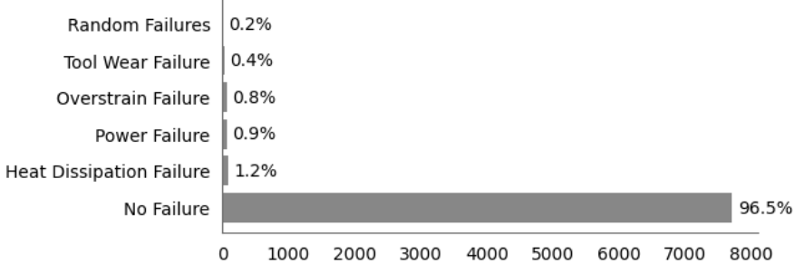
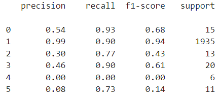
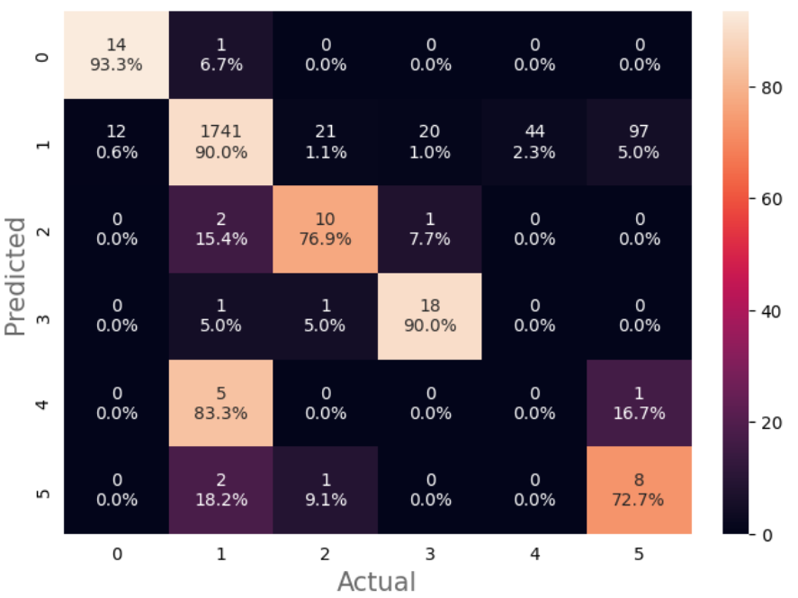

# Predicting type of machine failure

Predicting machine failure through machine learning is paramount for efficient industrial operations. By analysing data patterns, ML models can forecast potential breakdowns, allowing for proactive maintenance and minimising downtime. This predictive approach not only enhances equipment reliability but also optimises resource allocation.

## File structure

<pre>
|- machine-failure-type/
   |- custom_funcs.py
|- data/
   |- raw/
   |- cleaned/    
|- notebooks/
   |- data_exploration.ipynb
   |- predicting_failure_type.ipynb
   |- figures/
|- .gitignore
|- LICENSE
|- README.md
</pre>

## Scope

**_Context_**

* [The AI4I 2020 Predictive Maintenance Dataset](https://archive.ics.uci.edu/dataset/601/ai4i+2020+predictive+maintenance+dataset) is a synthetic dataset that reflects real predictive maintenance data encountered in industry. The below figure shows the breakdown of training instances by failure type.

    

* It will be assumed that faulty machinery would lead to decreased productivity and efficiency, quality issues, defective products, and potentially safety concerns for workers.

**_Model_**

* The goal was to predict type of failure. The problem was therefore framed as a multiclass classification problem.

**_Technical requirements_**

* In reality, the model would likely be deployed to an online endpoint so predictions could be generated in real-time (via a REST API).

* At this stage, the model will not be deployed. However, the low latency requirements of online deployment does place constraints on infrastructure and model complexity. For this reason, neural networks will not be tested as they can be slow at inference time due to the large number of operations.

**_Data requirements_**

* No further data collection was possible.

* No personal data is involved. Consequently, there are no apparent legal or ethical constraints (e.g., GDPR).

## Model performance metrics

* The performance metrics should align closely with the specific business problem at hand.

* Macro-recall across the failure classes reflects the model's ability to identify failed machinery (enabling minimisation of negatives). Whilst, macro-precision across the failure classes reflects the proportion of predicted failures which are correct (enabling minimisation of false positives). 

* It is assumed the cost of a false negative prediction (incorrectly identifying something as okay when it has failed) outweighs the cost of a false positive prediction. The primary and secondary metrics are therefore macro-recall and macro-precision across the failure classes respectively.

* The goal was to maximise macro-recall with a nominal constraint of $50\%$ for macro-precision across the failure classes.

* A custom macro-F1 score was used during hyperparameter optimisation. This calculated macro-F1 score across the different failure classes. It helped balance precision and recall with a view to preventing unnecessary disruptions while maintaining a sufficiently high recall for effective fault detection.

## Model selection

* Random forest models were optimised with and without SMOTE. The below table shows 5-fold cross validated performance. 

| Model | Macro-F1 | Macro-Precision | Macro-Recall |
|----------|----------|----------|----------|
| Random Forest  | $0.39 \pm 0.03$   | $0.39 \pm 0.03$ | $0.39 \pm 0.03$ |
| Random Forest with SMOTE  | $0.39 \pm 0.01$    | $0.30 \pm 0.01$ | $0.65 \pm 0.07$ |

* The goal was to maximise recall whilst ensuring a precision of at least $0.5$. Unfortunately, it was not possible to achieve this level of precision without SMOTE. Furthermore, the application of SMOTE appeared to improve recall but lower precision.
  
* The final random forest model utilised SMOTE. The below classification report and confusion matrix shows the test set performance after retraining with the entire training set. The macro F1, precision and recall scores across the failure classes are $0.37$, $0.28$ and $0.67$ respectively.

    *Where class $0$ is 'Heat Dissipation Failure', class $1$ is 'No Failure', class $2$ is 'Overstrain Failure', class $3$ is 'Power Failure', class $4$ is 'Random Failures', and class $5$ is 'Tool Wear Failure'.*

## Conclusion

* Overall predictive performance was insufficient as macro-precision across the failure classes did not meet the $0.5$ threshold. However, predictive performance for the two largest classes ($0$:'Heat Dissipation Failure', $1$: 'No Failure') was good.
  
* The results suggest retraining the model with a more balanced dataset may then improve overall performance. Specifically, more training data should be collected for 'Random Failures' and 'Tool Wear Failure'. The low proportion of relevant training instances resulted in poor predictive performance for these classes and in-turn lowered overall performance.